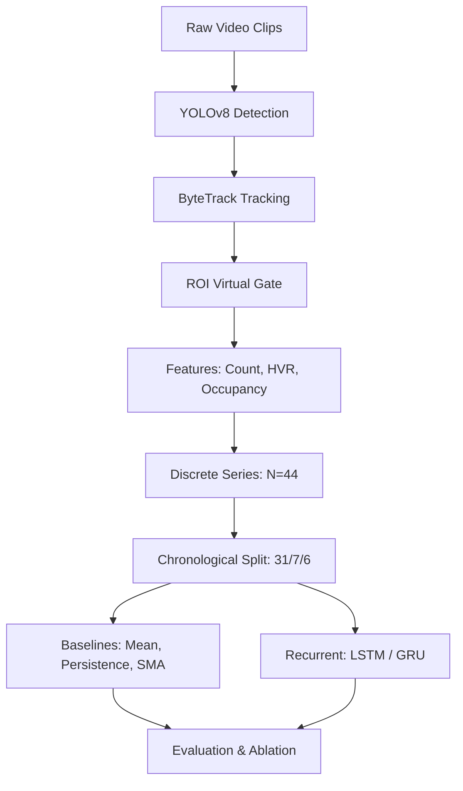
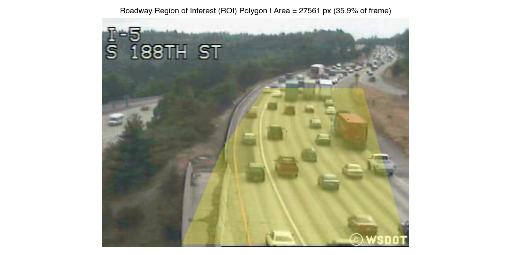

# Vision-Based Traffic Flow Prediction Using YOLOv8 and LSTM

This project implements an end-to-end pipeline transforming highway surveillance video into structured traffic observations and forecasting multi-step traffic-state vehicle counts using compact recurrent neural networks and statistical baselines under strict chronological evaluation.

## Key Results

- **Baselines**: SMA-3 achieved the lowest overall test MAE (0.6732) and RMSE (0.8814) among the evaluated models; SMA-5 had lowest $H_1$ MAE (0.2599).
- **Recurrent Benchmark**: Compact GRU was the top recurrent model (Test MAE 0.7843 vs. 1.0181 for LSTM; $H_1$ MAE 0.2706).
- **Ablation**: Count + HVR improved LSTM Test MAE to 0.9488; visual occupancy degraded performance (1.1565).
- **Horizons & Lookback**: GRU error grew across horizons ($H_1$ 0.2706 to $H_5$ 1.6977); $L=10$ lookback was optimal.

## Project Scope

This undergraduate BTech project evaluates short-horizon traffic forecasting from a single fixed camera across discrete video samples. It is not an enterprise platform or real-time control system.

## Research Question

> *Can visual and compositional features extracted from fixed-camera surveillance video improve short-horizon multi-step traffic forecasting over simple temporal baselines under strict chronological evaluation?*

## Pipeline



## Dataset

From the **Highway Traffic Videos Dataset**, containing fixed-camera highway surveillance clips from WSDOT Camera 052 on I-5 at S 188th St, Seattle, Washington:
- **Structure**: 44 clips recorded August 5, 2004, 17:00–20:00 ($320 \times 240$ at 10 fps, ~5.2s / 52 frames each).
- **Sampling**: Intermittent snapshots recorded every 4–5 minutes across an evening rush-hour transition.
- **Processing**: Processed independently as discrete observations without synthetic interpolation.

## Computer Vision Pipeline

- **Detection (YOLOv8)**: Pretrained `yolov8n.pt` detects cars, buses, and trucks ($\tau = 0.25$).
- **Tracking (ByteTrack)**: Intra-clip tracking with per-clip reset enables line crossing diagnostics at $y = 160$ ($x \in [100, 310]$).
- **ROI Isolation**: A 5-point polygon ($27{,}561$ px) isolates travel lanes. Target `total_vehicle_count` is the clip mean of ROI centroid inclusions; spatial occupancy is the union of vehicle bounding-box/ROI intersection areas divided by ROI area. Tracking assists line counting rather than overriding centroid inclusion.



## Traffic-State Features

Three clip-level features:
1. **Total Vehicle Count ($y_t$)**: Mean detected vehicles per frame within roadway ROI (forecast target).
2. **Heavy Vehicle Ratio (HVR)**: Proportion of trucks/buses: $(\bar{N}_{\text{truck}} + \bar{N}_{\text{bus}}) / \bar{N}_{\text{total}}$.
3. **Spatial Occupancy Ratio**: Union of vehicle bounding-box/ROI intersection areas divided by ROI area (visual proxy).

## From Video to Time Series

- **Intra-clip**: Detection, tracking, and occupancy operate strictly within each ~5.2s clip.
- **Inter-clip**: The 44 clip summaries form a discrete sequence ($k = 1, \dots, 44$) without synthetic interpolation.

## Forecasting Methodology

### Chronological Splitting & Windows
Chronological partition: Train (obs 1–31, 70.5%), Validation (obs 32–38, 15.9%), and Test (obs 39–44, 13.6%), with `StandardScaler` fitted on train. Target-anchored windows ($L=10, H=5$) ensure test steps fall strictly within the test partition (3 validation, 2 test windows; 10 horizon points).

### Models
- **Baselines**: Historical Mean ($\bar{y}_{\text{train}} = 7.408$), Persistence ($y_{t+h} = y_t$), SMA-3, and SMA-5.
- **Compact LSTM / GRU**: 1-layer recurrent networks (16 units, dropout 0.10; LSTM: 1,301 params, GRU: 997 params) trained with Adam ($\text{lr} = 0.01$, weight decay $10^{-4}$), MSE loss, max 150 epochs, and early stopping (patience 25).

## Sample Input & Output

Under target-anchored evaluation ($L=10, H=5$):
- **Input**:
  - Lookback window: 10 sampled traffic-state observations
  - Input shape: `(1, 10, 1)`
- **Output**:
  - Forecast horizon: 5 future observations
  - Output shape: `(1, 5)`
  - Target: future vehicle-count sequence

## Experiments & Results

### Benchmark Comparison (Test Partition)

Evaluated across test windows ($M_{\text{test}} = 2$, 10 horizon steps):

| Model | Type | Params | Test MAE | Test RMSE | $H_1$ MAE | $H_5$ MAE |
| :--- | :---: | :---: | :---: | :---: | :---: | :---: |
| Historical Mean | Baseline | 0 | 6.9241 | 6.9722 | 7.4077 | 6.6742 |
| Persistence | Baseline | 0 | 0.8603 | 1.0612 | 0.9215 | **0.4580** |
| SMA-3 | Baseline | 0 | **0.6732** | **0.8814** | 0.2712 | 1.1083 |
| SMA-5 | Baseline | 0 | 0.6860 | 0.9070 | **0.2599** | 1.1196 |
| Compact LSTM | Compact RNN | 1,301 | 1.0181 | 1.2587 | 0.8994 | 1.1813 |
| Compact GRU | Compact RNN | 997 | 0.7843 | 1.1713 | 0.2706 | 1.6977 |


#### Key Findings
- **Baselines**: SMA-3 achieved the lowest overall test MAE and RMSE among the evaluated models; moving averages act as strong regularizers on small sequences ($N=44$).
- **GRU vs. LSTM**: The GRU used fewer parameters than the LSTM (997 vs. 1,301) and achieved lower test error on this compact dataset (Test MAE 0.7843 vs. 1.0181; $H_1$ MAE 0.2706); the small evaluation set limits broader conclusions.
- **Horizon Behavior**: GRU error grew across horizons ($H_1$ 0.2706 to $H_5$ 1.6977); baselines were non-monotonic (Persistence reached $H_5$ MAE 0.4580).

### Feature Ablation (LSTM)
Adding vehicle composition (**Config B**: Count + HVR, Test MAE **0.9488**) improved over count-only LSTM (**Config A**: 1.0181). The additional features did not improve performance under this configuration (**Config C**: 1.1565; **Config D**: 1.0203), suggesting that the small training set may limit the benefit of the higher-dimensional input.

### Lookback Robustness ($L \in \{5, 10, 20\}$)
$L=10$ was optimal (Val MAE 0.5899, Test MAE 0.7843) vs. $L=5$ (Test MAE 1.0149) and $L=20$ (Test MAE 1.5275), where sample starvation on 31 training observations degraded performance.

### Uncertainty & Transition Analysis
- **Prediction Intervals**: Calibrated on validation residuals ($q_h = \max_{i \in \text{Val}} |e_{i, h}|$), empirical intervals achieved 60.0% test coverage (mean width 1.726; 100% on $H_1$–$H_2$, 50% on $H_4$–$H_5$).
- **Transition Dynamics**: GRU MAE climbed from 0.5939 in stable flow to 0.9747 ($H_5$ MAE 2.8221) during rapid transitions.


## Applications

- **CCTV Traffic Monitoring**: Automated vehicle presence and class distribution logging.
- **Short-Horizon State Forecasting**: Anticipating queue buildup during rush-hour transitions.
- **Congestion Analysis**: Tracking bottleneck onset and dissipation via visual state proxies.
- **Intelligent Transportation Systems (ITS)**: Lightweight decision support for advisory signals.

## Repository Structure

```text
vision-based-traffic-forecasting-dl/
├── configs/          # Configuration (config.yaml)
├── src/              # Detection, tracking, preprocessing, models
├── notebooks/        # 16 research notebooks across 4 stages
├── models/           # Checkpoints (.pt)
├── outputs/          # Benchmark tables, figures, predictions
├── tests/            # Test suite (pytest)
├── requirements.txt  # Dependencies
└── README.md
```

## Reproducibility & Workflow

```bash
git clone https://github.com/manishzx17/vision-based-traffic-forecasting-dl.git
cd vision-based-traffic-forecasting-dl
python3 -m venv venv && source venv/bin/activate
pip install -r requirements.txt
pytest tests/test_smoke.py -v
```

The 16 notebooks cover 4 stages: CV extraction (`01`–`04`), series construction (`05`–`07`), forecasting (`08`–`11`), and evaluation (`12`–`16`). Raw clips reside in `archive/video/` (git-ignored); precomputed tables and checkpoints are tracked for immediate execution.

## Limitations & Future Work

- **Sample Size**: $N = 44$ discrete observations limits sequence length.
- **Intermittent Sampling**: 4–5 minute snapshot intervals rather than continuous streams.
- **Monocular Viewpoint**: Spatial occupancy is a 2D image proxy without perspective homography.
- **Single Location**: Evaluated on one fixed CCTV perspective without cross-camera validation.

**Future Work**: 24-hour continuous feeds, inverse perspective mapping for physical density ($\text{veh/km/lane}$), and spatio-temporal graph neural networks across camera networks.

## Technologies

- **Stack**: Python 3.9+, PyTorch, Ultralytics YOLOv8, OpenCV, ByteTrack, NumPy, pandas, scikit-learn, SciPy, Matplotlib, PyYAML, pytest

## References

- **Dataset**: Highway Traffic Videos Dataset (WSDOT Camera 052, Seattle, WA; https://www.kaggle.com/datasets/aryashah2k/highway-traffic-videos-dataset).
- **Detection**: Ultralytics YOLOv8 (https://github.com/ultralytics/ultralytics).
- **Tracking**: ByteTrack (Zhang et al., ECCV 2022).
- **Framework**: PyTorch (https://pytorch.org).

## Summary & Key Takeaways

This project demonstrates an end-to-end pipeline bridging vision-based vehicle perception and discrete sequence forecasting under chronological evaluation. Benchmarking compact recurrent neural networks against statistical baselines confirms that simple baselines serve as strong regularizers on compact sequence datasets. Systematic ablation, lookback sensitivity, and calibrated prediction intervals reinforce disciplined diagnostic evaluation under real-world camera constraints.
