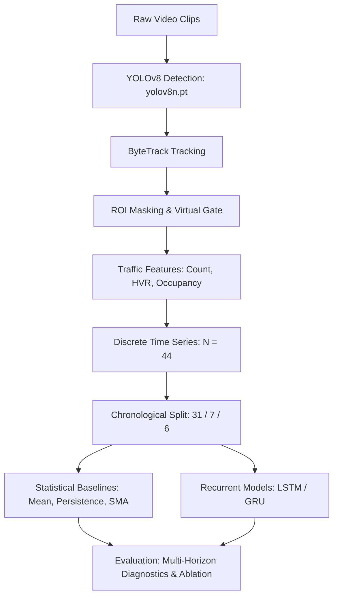
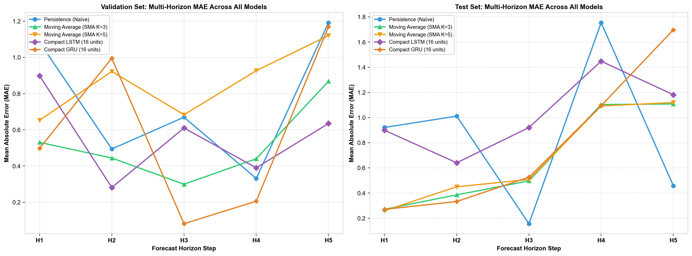
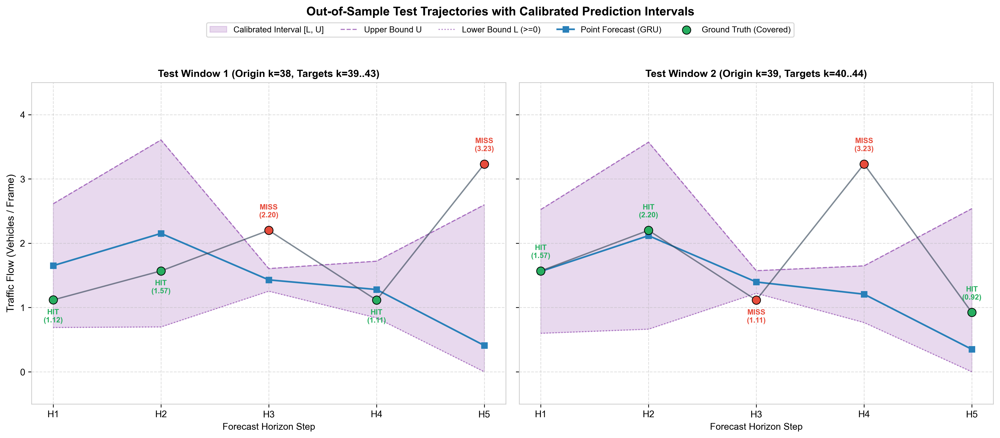

# Vision-Based Traffic Flow Prediction Using YOLOv8 and LSTM

This project implements an end-to-end machine learning pipeline that transforms raw highway surveillance video into structured traffic-state observations and forecasts multi-step traffic volume using recurrent neural networks and statistical baselines.

Overhead CCTV cameras provide an accessible alternative to expensive, spatially constrained inductive loops. We extract discrete traffic time series from surveillance clips using YOLOv8 detection, ByteTrack tracking, and region-of-interest (ROI) analysis, then evaluate whether compact LSTM and GRU models improve short-horizon forecasting over classical baselines under strict chronological evaluation.

## Key Components

- **YOLOv8 Detection**: Vehicle localization (cars, buses, trucks) using pretrained `yolov8n.pt`.
- **ByteTrack Tracking**: Tracklet persistence with per-clip state reset to prevent identity leakage.
- **ROI Spatial Features**: Polygon-gated counting and visual roadway occupancy proxy estimation.
- **Leakage-Safe Partitioning**: Chronological 70/16/14 split with target-anchored evaluation windows.
- **Model Benchmarking**: Evaluating Persistence, Mean, and SMA against compact LSTM and GRU models.
- **Diagnostic Analysis**: Feature ablation, horizon error drift, lookback sensitivity, and prediction intervals.

## Project Scope

This experimental undergraduate final-year BTech project evaluates short-horizon traffic forecasting from a single fixed-camera surveillance perspective across discrete video samples. It is not an enterprise traffic-management platform or a continuous real-time control system.

## Research Question

> *Can visual and compositional features extracted from fixed-camera surveillance video improve short-horizon multi-step traffic forecasting over simple temporal baselines under strict chronological evaluation?*

## Pipeline



## Dataset

Surveillance video comes from the **UCSD Traffic Dataset** (Interstate 5, San Diego):

- **Structure**: 44 discrete clips from 17:00–20:00 on August 5, 2004 ($320 \times 240$ at 10 fps, ~5.2s / 52 frames each).
- **Sampling**: Intermittent snapshots recorded every 4–5 minutes across an evening rush-hour transition (congested queueing to light traffic).
- **Processing**: Clips are processed independently as discrete observations without synthetic concatenation.

## Computer Vision Pipeline

- **Detection (YOLOv8)**: Pretrained `yolov8n.pt` detects cars, buses, and trucks ($\tau = 0.25$).
- **Tracking (ByteTrack)**: Associates frame detections; tracker state strictly resets per clip to avoid identity leakage.
- **ROI & Virtual Gate**: A 5-point polygon ($28{,}562$ px) isolates travel lanes, counting vehicles by centroid inclusion and checking southbound flow at $y = 160$ ($x \in [100, 310]$).

## Traffic-State Features

Per clip, frame detections yield three summary features:

1. **Total Vehicle Count ($y_t$)**: Mean detected vehicles per frame within the roadway ROI.
2. **Heavy Vehicle Ratio (HVR)**: Proportion of trucks/buses to total detections: $(\bar{N}_{\text{truck}} + \bar{N}_{\text{bus}}) / \bar{N}_{\text{total}}$.
3. **Spatial Occupancy Ratio**: Bounding-box intersection area with ROI divided by ROI area—serving as a visual pixel proxy, not physical density.

## From Video to Time Series

The pipeline maintains an explicit methodological separation:
- **Intra-clip processing**: Frame-by-frame detection, tracking, and occupancy operate strictly within each ~5.2s clip.
- **Inter-clip sequence**: The 44 clip summaries form a discrete chronological sequence ($k = 1, \dots, 44$). No synthetic interpolation is applied across the 4–5 minute inter-clip gaps.

## Forecasting Methodology

### Chronological Splitting & Target-Anchored Windows
Data is split chronologically without shuffling: Train (obs 1–31, 70.5%), Validation (obs 32–38, 15.9%), and Test (obs 39–44, 13.6%). A `StandardScaler` is fitted strictly on the training partition.

Under target-anchored windowing ($L = 10, H = 5$), target steps fall entirely within their designated partition, while lookback context warms up recurrent states. This produces 3 validation windows and 2 test windows (10 evaluated horizon points) shared identically across all models.

### Models
- **Baselines**: Historical Mean ($\bar{y}_{\text{train}} = 7.408$), Persistence ($y_{t+h} = y_t$), SMA-3, and SMA-5.
- **Compact LSTM / GRU**: Single-layer models (16 hidden units, dropout 0.10; LSTM: 1,285 parameters, GRU: 1,029 parameters) projecting to 5 output steps via linear head. Trained with Adam ($\text{lr} = 0.001$), MSE loss, and early stopping (patience 25) on validation loss.

## Experiments & Results

### Benchmark Comparison (Test Partition)

Evaluated across identical test target windows ($M_{\text{test}} = 2$ windows, 10 horizon steps):

| Model | Type | Params | Test MAE | Test RMSE | $H_1$ MAE | $H_5$ MAE |
| :--- | :---: | :---: | :---: | :---: | :---: | :---: |
| Historical Mean | Baseline | 0 | 6.9241 | 6.9722 | 7.4077 | 6.6742 |
| Persistence | Baseline | 0 | 0.8603 | 1.0612 | 0.9215 | 0.4580 |
| **SMA-3** | Baseline | 0 | **0.6732** | **0.8814** | **0.2712** | **1.1083** |
| SMA-5 | Baseline | 0 | 0.6860 | 0.9070 | 0.2599 | 1.1196 |
| Compact LSTM | Deep RNN | 1,285 | 1.0181 | 1.2587 | 0.8994 | 1.1813 |
| Compact GRU | Deep RNN | 1,029 | 0.7843 | 1.1713 | 0.2706 | 1.6977 |



#### Key Findings
- **Baseline Strength**: Statistical SMA-3 achieved the lowest test error (MAE 0.6732), outperforming both deep models—confirming that simple moving averages serve as strong regularizers on compact datasets ($N=44$).
- **GRU vs. LSTM**: Compact GRU outperformed Compact LSTM (Test MAE 0.7843 vs. 1.0181; $H_1$ MAE 0.2706 vs. 0.8994), benefiting from fewer gating parameters (1,029 vs. 1,285).
- **Horizon Drift**: Error compounds across multi-step horizons: Compact GRU degraded from $H_1$ MAE 0.2706 to $H_5$ MAE 1.6977 (+527%).

### Feature Ablation (LSTM)
Evaluating auxiliary visual inputs on Compact LSTM:
- Adding vehicle composition (**Config B**: Count + HVR, Test MAE **0.9488**) improved over univariate count (**Config A**: Test MAE 1.0181).
- Adding spatial occupancy alone (**Config C**: Test MAE 1.1565) or all features (**Config D**: Test MAE 1.0203) increased error due to feature over-specification on 31 training observations.

### Lookback Robustness ($L \in \{5, 10, 20\}$)
Evaluating historical context on Compact GRU confirmed $L=10$ as optimal:
- **$L=5$** (22 windows): Val MAE 0.7941, Test MAE 1.0149
- **$L=10$** (17 windows): Val MAE **0.5899**, Test MAE **0.7843**
- **$L=20$** (7 windows): Val MAE 1.5461, Test MAE 1.5275

Degradation at $L = 20$ is primarily driven by sample starvation: burn-in requirements on 31 training observations leave only 7 usable training sequences.

### Uncertainty & Transition Analysis
- **Prediction Intervals**: Calibrated on validation residuals ($q_h = \max_{i \in \text{Val}} |e_{i, h}|$) and clipped at zero, empirical intervals achieved 100% coverage on $H_1$–$H_2$ and 50% on $H_4$–$H_5$ (60.0% overall test coverage, mean width 1.726).
- **Transition Dynamics**: Compact GRU achieved MAE 0.5939 ($H_1$ MAE 0.0081) during stable flow, but error climbed to MAE 0.9747 ($H_5$ MAE 2.8221) during rapid transitions, indicating autoregressive response lag.



## Repository Structure

```text
traffic-flow-yolo-lstm/
├── configs/          # Pipeline configuration (config.yaml)
├── src/              # Core modules: detection, tracking, preprocessing, models
├── notebooks/        # 16 research notebooks (EDA to sensitivity analysis)
├── models/           # Trained PyTorch model checkpoints (.pt)
├── outputs/          # Benchmark tables, diagnostic figures, predictions
├── tests/            # Automated test suite (pytest)
├── requirements.txt  # Dependencies
└── README.md
```

## Reproducibility

```bash
# Clone repository and install dependencies
git clone https://github.com/manishzx17/vision-based-traffic-forecasting-dl.git
cd vision-based-traffic-forecasting-dl
python3 -m venv venv && source venv/bin/activate
pip install -r requirements.txt

# Run automated smoke tests
pytest tests/test_smoke.py -v
```

## Limitations & Future Work

- **Sample Size**: $N = 44$ discrete observations limits sequence length and statistical power.
- **Intermittent Sampling**: Video clips represent sampled snapshots every 4–5 minutes rather than continuous video feeds.
- **Monocular Viewpoint**: Spatial occupancy is calculated in 2D image coordinates without inverse perspective mapping to ground coordinates.
- **Single Location**: Evaluated on one fixed CCTV perspective along Interstate 5 without cross-camera validation.

**Future Work**: Continuous 24-hour video feeds for diurnal cycles, bird's-eye-view (BEV) homography for physical density ($\text{veh/km/lane}$), and spatio-temporal graph neural networks across multi-camera networks.

## Technologies

- **Stack**: Python 3.9+, PyTorch, Ultralytics YOLOv8, OpenCV, ByteTrack, NumPy, pandas, scikit-learn, SciPy, Matplotlib, PyYAML, pytest
